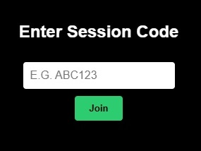
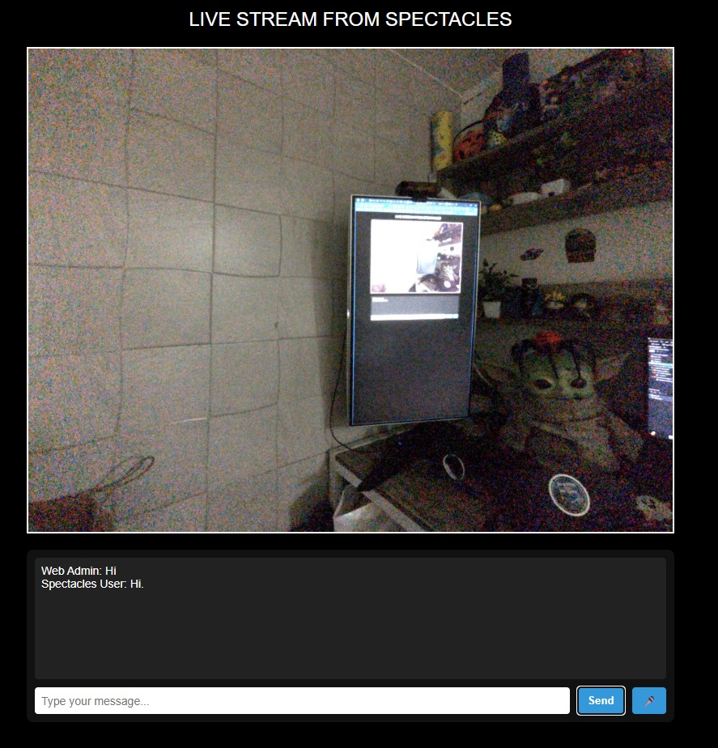

# 🧠 Remote ARsistance

**Remote ARsistance** is a real-time, session-based remote assistance tool powered by **SnapAR Glasses Spectacles**. It enables seamless live **video streaming**, **annotation**, and **chat communication** between a field technician and a remote expert  using **WebSockets**, **Speech Recognition (ASR)**, and **interactive UI overlays**.

> ⚡ Ideal for remote support, field repair, inspection workflows, and collaborative XR tasks.

---

## 🎥 Demo Video

[](https://youtu.be/8dSow1P_gng)

## 🚀 Features

### 📡 1. Live Video Streaming (from Spectacles)
- Spectacles camera feed is encoded in base64 and streamed in real-time to the web client using the Camera Module & Websocket.
- Efficient data transfer over WebSocket with frame boundary management.
- Frame decoding and display on `<canvas>` element.

---

### 🔐 Session Login  
🔄 Real-time session binding between the Spectacles and Web Client using unique 6-digit codes.



---

### 💬 2. Two-Way Chat System  
🔊 Exchange guidance and instructions between remote expert and AR user using text based chat system.



---

### 🖊️ 3. Real-Time Annotation  
🖱️ Click-to-annotate from web reflects in AR view instantly.


---

### 🔄 4. Session Management
- Unique **session codes** ensure private, one-to-one connections.
- Spectacles won’t stream unless a web client joins the same session.
- Auto cleanup on disconnection.

---

### 🎙️ 5. ASR Module (Automatic Speech Recognition)
- Real-time speech-to-text using Lens Studio's `AsrModule`.
- Spectacles user can talk — message appears instantly on web.

---

## 🛠️ Tech Stack

| Part             | Tech                                    |
|------------------|-----------------------------------------|
| AR Glasses       | Spectacles (via Lens Studio scripting)  |
| Web Backend      | Node.js + Express + WebSocket (ws)      |
| Frontend         | HTML5, Canvas, JavaScript               |
| Voice Input      | Lens Studio `AsrModule` + Web Speech API|
| Camera Stream      | Lens Studio `CameraModule` + Base64 Encoding|
| UI Rendering     | Live canvas, DOM-based chat & prompt UI |

---
Thanks for catching that! Let's add the missing **MainController.js** and update the structure accordingly.

Here’s the corrected **full project structure** for your `Remote ARsistance` repo, now including everything:

---

### 📁 Project Structure
```
Remote ARsistance/
│
├── Websocket Server/                 # Node.js backend
│   ├── node_modules/                 # Dependencies
│   ├── public/                       # Static frontend for remote viewer
│   │   └── index.html                # Live stream + annotation + chat UI
│   ├── package.json                  # NPM config
│   ├── package-lock.json             # NPM lockfile
│   └── server.js                     # Core WebSocket + session logic
│
├── Remote ARsistance LS/             # Lens Studio project folder
│   └── Assets/
│       ├── Addons/                   # Optional LS plugins
│       ├── Materials/                # Shaders, PBR materials, etc.
│       ├── Meshes/                   # Any imported 3D geometry
│       ├── Others/                   # Misc. files
│       ├── Physics/                  # AR physics assets
│       ├── Prefabs/                  # AR overlays or interactive prefabs
│       └── Scripts/
│           ├── Modules/              # Helper or shared modules
│           ├── AnnotationRenderer.js     # Draws annotation UI from web
│           ├── ASRHandler.js             # Uses speech API to convert to text
│           ├── CameraStream.js          # Captures video feed and sends to web
│           ├── SessionManager.js        # Handles session code generation/login
│           ├── WebSocketClient.js       # Client logic to talk to Node WS server
│           └── MainController.js        # Central coordinator (initializes flow)
│
└── README.md                         # Documentation with feature highlights
```

Absolutely! Here's the full **📦 Server Setup** section you can drop into your README, including the `localhost` vs `wss` behavior for Lens Studio editor vs Spectacles device, and clear Ngrok usage:

---

## 📦 Server Setup

The backend server uses **Node.js**, **Express**, and **WebSocket (ws)** to manage real-time streaming, annotation, chat, and session handling between Spectacles and the web client.

### 🛠️ Prerequisites

* Node.js (v16+ recommended)
* [Ngrok](https://ngrok.com/) (for WSS tunneling when testing on Spectacles)

### 📁 Install Dependencies

```bash
cd Websocket\ Server/
npm install
```

### ▶️ Start the Server

```bash
node server.js
```

This will start the WebSocket + static server on:

```
http://localhost:8080
```

You can open this in your browser to test the live stream UI.

---

## 🌐 Localhost vs WSS (Important!)

### ✅ Works on Lens Studio Editor (Preview Mode):

* You can set the WebSocket server to `ws://localhost:8080`
* Works directly when previewing inside Lens Studio editor

### ❌ Won’t Work on Spectacles Device:

* Spectacles **require secure `wss://` WebSocket**
* `localhost` or `ws://` will **fail silently** on-device

---

## 🚇 Use Ngrok for Secure Tunnel (For Spectacles Testing)

To bridge your localhost to a secure WebSocket endpoint:

```bash
ngrok http 8080
```

You’ll get a secure URL like:

```
https://random-subdomain.ngrok.io
```

Convert that to WebSocket:

```
wss://random-subdomain.ngrok.io
```

> 💡 **Inside Lens Studio**:
> Pass only `random-subdomain.ngrok.io` to your `wssURL` input.
> The script will add the `wss://` prefix automatically. 
```js
const socket = new WebSocket("wss://" + script.wssURL);
```


---


## 🧪 How It Works

1. **Spectacles User** starts the Lens → Generates a session code (e.g., `KD87FZ`)
2. **Web Client** enters the code on the browser → joins the session
3. Once connected:
   - Spectacles stream begins
   - Chat + ASR are enabled
   - Web can annotate directly on live feed
4. If specs user disconnects, the session is cleaned up and auto-refreshes on web.

---

## 🔐 Security & Constraints
- One Spectacles + One Web client per session.
- Sessions are unique, private, and ephemeral.

---

## ✨ Future Work
- Voice communication
- Multi-user conferencing
- Drawings, Shapes etc.

---

## 🧠 Made With Love by Krazyy Krunal

> ⚙️ *All Things Krazyy* | XR for Real Impact

